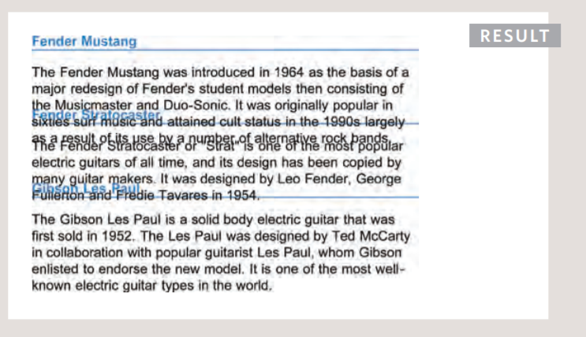

# HTML Lists, CSS Boxes, JS Control Flow

## HTML Lists Types:

- Order List: can be created by `<ol>` tag

Every list item `<li>` inside it is numbered automatically

- Unorder List: can be created by `<ul>` tag

Every list item `<li>` inside it is followed by a dots/bullets automatically

- Definition List: an be created by `<dl>` tag
Consists of a terms andtheir definitions
`<dt>` is used to contain the term
`<dd>` is used to contain the definition

> Lists can be **nested** inside one another.

## CSS Boxes:
Customizing box dimensions:
through using `width` and `height` to make the boxes smaller or bigger
the boxes normally have enough space to hold the whole contents.

You can also limit the width and height so contents doesnt lose its shape
when opened in device with smaller or bigger screens

And Thats can be achived by using `min-width`, `max-width`

And `min-height`, `max-height`

But If the box is not big enough to hold the content, the content
will expands outside the box, And It really hurt the eyes

In THat Case Comes OverFlowing Content Job:
to tell the broswer what to do with contenet that expanded outside 

`hidden` command hides them and wont show them at all
`scroll` command  adds a scrollbar to the box so that users can scroll
to see the missing content.

Padding, Border and margin

by knowing those 3 you can Customize them:
**The Margin:** can be Customized in the 4 directions so you decide how farm an item will be from the others
from the 4 directions
`margin-top`
`margin-right`
`margin-bottom`
`margin-left`

the values inserted in the same order `margin: 1px 2px 3px 4px;`
or if you insert one value it will apply to all `margin: 4px;`

**The Border:** it is invisible by default:

* width can by valued by single number or 4 numbers for the 4 directions or thin medium thick
* style
 * solid
 *  dotted 
 * dashed 
 * double 
 * groove
 * ridge 
 * inset 
 * outset 
 * hidden / none 

 

* color 

**Padding:** the area inside the border

to center a box place the right and left margin values to auto after giving it a specific width
If you didnt do so it's width will be the same as the page

**The inline/Block display**
`inline` causes a block-level element to act like an inline element.

`block`:
causes an inline element to act like a block-level element.

`inline-block`:
This causes a block-level element to flow like an inline element, while retaining other features of a block-level element.

`none`:
This hides an element from the page. For boxes it is `hidden` and `visible`

**Customizing Box Shadow:**
box-shadow Horizontal Vertical Blur distance Spread of shadow color 
Example:

`box-shadow: 5px 5px 5px 5px #777777;` 

**Rounded Corners:**
To get a Rounded Corners use this command Example:
`border-radius: 10px;`
or st values for top left, top right, bottom right, bottom left bu same order
ex:
`border-radius: 10px 20pc 15px 11px;`

## JavaScript Control Flow

**Arrays:**

When you are using the variabiles to assign multi-values it is named Array
The values in Arrays are numbered by default and you can call them by number
the numbering starts from 0,1,2,..etc
And you can update the value as following:

**If Else Statment**
It checks condition if it is true the code will be executed If ts is false it runs the second code instead

**Switch Statments**
starts with a variable called the switch value

Each case indicates a possible value for this variable and the code that should run if the variable matches that value

 

**TRUTHY & FALSY VALUES**
Due to type coercion, every value in JavaScript can be treated as if it were true or false.

**LOOPS**
How does Loops Work:

- A For Loop used when you want to run the loop for specific number

- A While Loop When you dont know how much times the code will run, it will stops when codition = false

- Do While Loop It will run at least one time even if it was false

It will run tell the condition Is fulfilled

