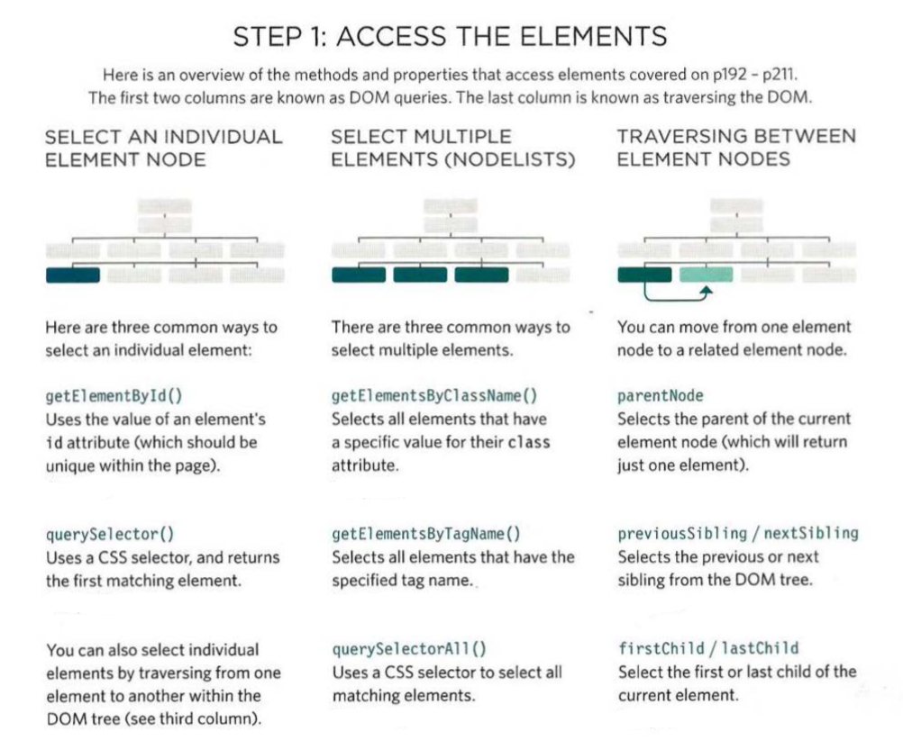

# JS Object Literals; The DOM
## The Problem Domain
They are hardest thing about programming and the reason is because usually you dont know what are you trying to build and will you approach it

You can simplify the problems by:

- Starting with understanding it and observing the whole picture
- Breaking it into parts
- solving the parts one by one
- find the proper way to merge the parts solutions

It is really easier to solve the problem this way instead of starting coding immediately

## What is an Object?
> "Objects group together a set of variables and functions to create a model
of a something you would recognize"

If a variable is part of an object, it is called a property
If a function is part of an object, it is called a method

This photo shows the object `hotel`

the whole object is in carly braces and the properties and methods are inside

If you want to call a method or a property from it you can follow the example
for properties you can type:

`var hotelname = hotel.name;`

or 

`var hotelname = hotel['name'];`

and for methods you may only use dots

`var hotelname = hotel.checkAvailability();`

##  DOM tree

As a browser loads a web page, it creates a model of that page.

It consists of four main types of nodes:

- The Document Node: It represents the entire page, and it is the head of it
- Element Node: Those what describe the structure of page Like `<h1>,<h2>,<h3>,...<body>,
......`
- Attribute Nodes: those are used to have special function on specific elements or give them names or classis, also cant have children
- Text Node: The last node of the tree and cant have children, where the actual content rest

> Each node is an object with methods and properties.

#### Working With Dom Tree

How to access and select the elements:

How to work with them:

After the script fid the node you are looking for and selecte it you can now work with it or their perant or child

and you can als ostore it in variables like

`var item = getElementByld ('book1')`

If a method can return more than one node, it will always return a Nodelist
For example:
several elements can have the same tag name,
so get ElementsByTagName () will always return a Nodel list

You better consider the fastest way to find nodes so your page feels faster

A Nodelist is a collection of element nodes. Each node is given an index number Like the Array

When a DOM query returns a Nodelist, you may want to:

- Select one element from the NodeList
- You have to use the loops to find the elemen/s you are looking for

The NodeList may be live or static
Live NodeList updates when your cade do so for your page while static NodeList doesn't

#### So, How to select the element from NodeList?

To applay changes to a whole NodeList you may choose looping in there array, for ex:

How to traverse through the DOM 

And the same goes for the rest

DOM manipulation methods
How to creat/ delete nodes

example: how to add a list item

- Create the text
- Create the element node 
- Place the text in it
- Select the element that you need to ad it to
- Then append your work 

Thats about adding but how to remove?

- First store the element you want to remove in var
- Then store the parent in another
- Then remove the element from the containning one

### Cross-Site Scripting and(XSS) Attacks

If you add HTML to a page using innerHTML (or several jQuery methods),
you need to be aware of Cross-Site Scripting Attacks or XSS; otherwise,
an attacker could gain access to your users' accounts.

XSS can give the attacker access to information in:

- The DOM (including form data)
- That website's cookies
- Session tokens: information that identifies you
from other users when you log into a site

This could let the attacker access a user account and:

- Make purchases with that account
- Post defamatory content
- Spread their malicious code further I faster

How to Defend Against?

Validate Input
- Dont allow visitors to write html or java
- Double-check Validation on the server before displaying user content/storing it in a database.
This is important because users could bypass validation in the browser by turning JavaScript off. 
