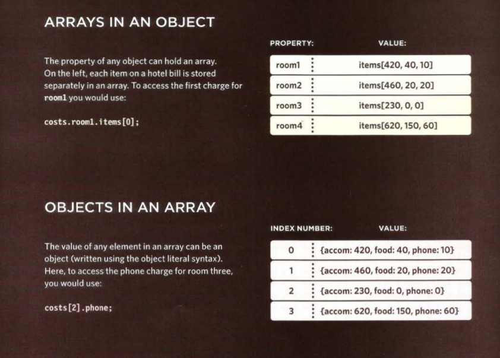
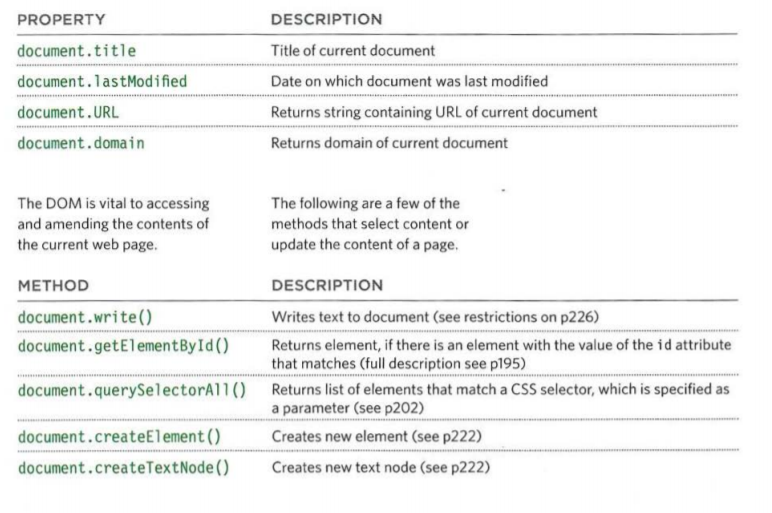
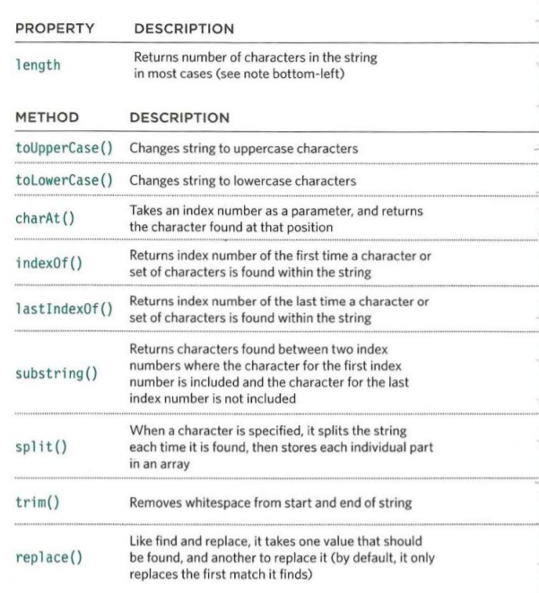
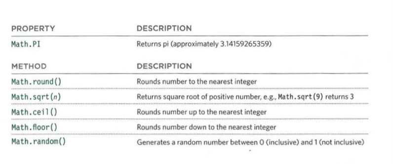
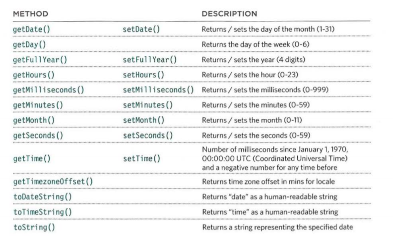

# HTML Tables; JS Constructor Functions

> ### Generate random numbers
You can generate randome numbers using the command `math.random` or `generateRandom` and set a min and max value for it, 
Like in the example below:

`EpicFailVideo.prototype.generateRandom = function(min, max) {`
  `return Math.floor(Math.random() * (max - min + 1)) + min;`
`}`

## What's a Table

A table represents information in a grid format.

Basic Table Structure

- `<table>` That is used ti create it
- `<tr>` table rows, that have td inside it
- `<td>` table data

- `<th>` table heading, like `<td>` but it is used for the heading

#### spanning Columns
An attribute used to make the cell occiputs more than one cell besides the other to display it's content like in the example:
`<td colspan="2">Geography</td>`

#### spanning Rows

The same goes for Rows, when you use it this way the cell will take the place of 2 cells one above the other
`<td rowspan="2">Geography</td>`

### Long Tables

`<thead>` used for the heading
`<tbody>` contain the row values
`<tfoot>` footer of the table 

Once Upon the time Width & Spacing attributes were being used in the table tag
same goes for Border & Background (bgcolor)

## JS Creating an object Constructor Notation

Use new keyword and the name of the object to create an empty one

Updating it:
You can use Dot Notation or Square Brackets ex:

`hotel.name = 'Star';`

Or 

`hotel['name'] = 'Star';`

and for methods you may only use dots

`var hotelname = hotel.checkAvailability();`

Adding and removing properties: using the keyword delete
`delete ObjectName.ProparityName;`

(This) Keyword
First let me tell you about the scope

When a function is written on the JavaScript without being inside anything else it will be on the global scope
it can be called annywhere in the JS file

while when it is written inside object or something it will be local and it only can be called from inside the object or from outside by calling the object name first

and the same goes for variables and properties
and the (This) kewword can be used to call a property inside an object to use it in the methods and functions

> Arrays are cosidered objects

Built-In Objects:
> Browsers come with a set of built-in objects that represent
> things like the browser window and the current web page shown in that window.
> These built-in objects act like a toolkit for creating interactive web pages.

Three Groups Of Bulit-In Objects:

- Broswer Object Model The window object represents the current
browser window or tab. It is the topmost object
in the Browser Object Model, and it contains
other objects that tell you about the browser. 

- Documant Object Model

used to provide info about page or creat elements
- Global JS Objects

##### Data Types we know By now:

1. String
2. Number
3. Boolean
4. Undefined (a variable that has been declared)
5. Null
6. 0bject 

- Number Object Methods:

- isNaN() :checks if not a number
- toFixed() :Rounds to specified number of decimal places (returns a string)
- toPrecision():Rounds to total number of places (returns a string)
- toExponentia1():Returns a string representing the number in exponential notation

- Math Objects

- Data Objects

> Arrays and objects can be used to create complex data sets (and both can contain the other). 

