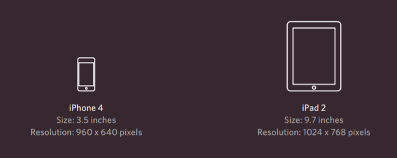
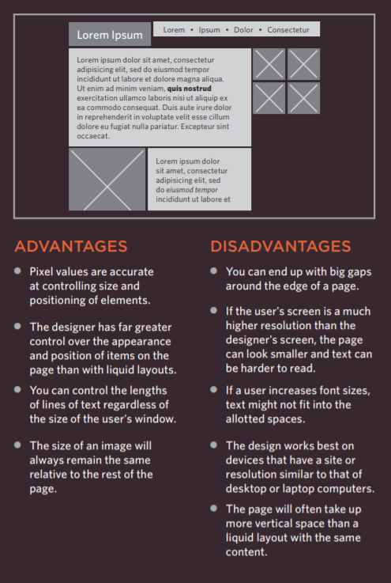
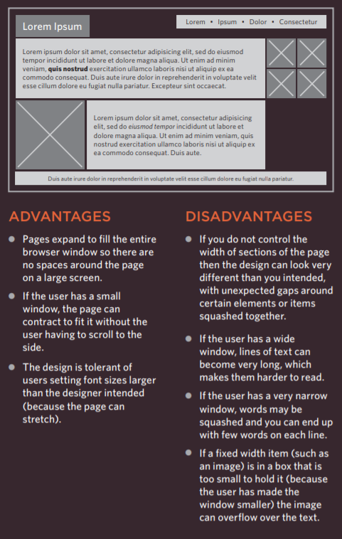
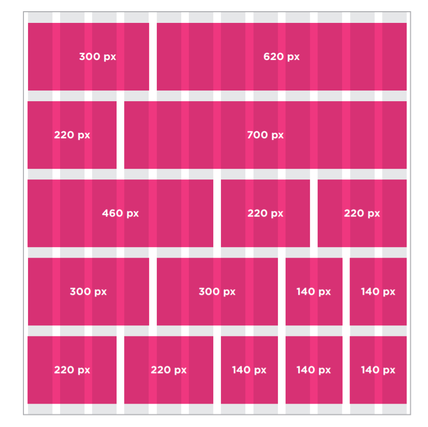

# More CSS Layout

## Revision

## CSS Layout:

The CSS is trating elements as if they are in their own boxes (block level box) or (inline box) by default.

**Block-level: Starts on a new line**
**Inline elements: Flow in between surrounding text**

If one block-level element sits inside another block-level element

then the outer box is known as the containing or parent element.

There is somrthing in CSS called positioning schemes that allow you to control the layout of a page:

- Normal flow Every block-level element appears on a new line

Normal Flow
by default the browsers make each element sits on the top of the next one but if you want the syntax for it it is 

`position:static`

**Relative Positioning:** This moves the element in the 4 directions
from its position in normal flow with out affecting other elements around it

**Absolute Positioning:** The box offset properties (top or bottom and left or right)
specify where the element should appear in relation to its containing element
gets the element out of normal flow
makes the element get out of the flow and get ignored by other elements

**Fixed Positioning:** This make the element has a fixed position
on the screen and will stay in the same postion in the viewer screen
even when he scroll down *-gets out of the flow-*

**Overlapping elements:** Moving elements on the z-index giving an element a hight z-index value

will make it appeare in front of other elements

**Floating Elements:** makes the element float to the far left or right,

gets oyt of the flow and make it block level element

Clearing floats: clear used to say that it is not allowed to touch elements 
floating in the 

- `clear:left;` left side
- `clear:right;`right side
- `clear:both;`both sides
- `clear:none;`it is allowed to do so for both sides

if all contend of and element are set to be floating the browser will consider it as 0 pixel element and collapse it
to solve that here is the 2 rules that developers made for this issue

`overflow: auto;`
`width: 100%;`

**Screen Sizes**

The user can see as much as his screen let him do
and because screens vary in sizes and resolutions it is optimal for designers to 
create pages around 960-1000 px so the most can see it as intended to be

**Fixed Width Layouts**

**Liquid Layouts**

In order to use **Liquid Layouts** use `em` and `%` instead of `px`

Using the 960.GS Grid

this layout dividing page into 12 columns from 960 pixle

it also provide other templates you can download to help you design your website
it handles the whole layout you just have to set the fonts ,colors ,backgrounds ,margins and paddings

**Using Multiple Style Sheets**
you can do it either by using 2 `link` in your HTML

Or

Liking to one style sheet and using `@import` to import from other style sheets
EX:

`@import url("colors.css");`