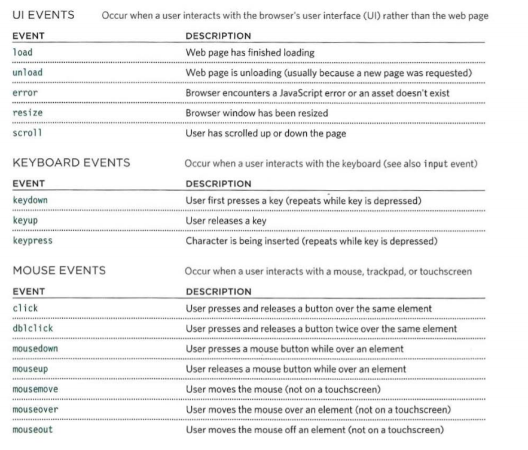

# Forms and JS Events

forms allow users to perform functions.

## Form Controls

- ADDING TEXT:
  - Text input: (single-line) Used for a single line of text
  - Password input: Like a single line text box but it masks the characters entered
  - Text area (multi-line)

- Making Choices:
  - Radio buttons: For use when a user must select one of a number of options.
  - Checkboxes: When a user can select and unselect one or more options
  - Drop-down boxes: When a user must pick one of a number of options from a list.

- Submitting Forms:
  - Submit buttons: To submit data from your form
  - Image buttons: Similar to submit buttons but they allow you to use an image

- Uploading Files:
  - File upload: Allows users to upload files to a website

### How Forms Work

> A form may have several form controls, each gathering different information.

### Form Structure

`<form>`
This element should always carry the action attribute and will usually have a method and id attribute too.

`action`
Its value is the URL for the page on the server that will receive the information in the form when it is submitted.

`method`
Forms can be sent using one of two methods: get or post.

`id` It may also have id 

### Text Input

`<input>`
used to create several different form controls.

`type="text"`
 creates a singleline text input.

 `name`

`maxlength`
limit num of charecter inserted

`size`
The size attribute should not be used on new forms. It was used in older forms to indicate the width of the text input (measured by the number of characters that would be seen)

`Password Input`

`<input>`
`type="password"`
When the type attribute has a value of password it creates a text box that acts just like a single-line text input, except the characters are blocked out.

`name`
The name attribute indicates the name of the password input

`size, maxlength`
It can also carry the size and maxlength attributes like the the single-line text input.

### Text Area

`<textarea>` element is used to create a mutli-line text input.

### Radio Button

`<input>`
`type="radio"`
Loow for one option

`name`
The name attribute is sent to the server with the value of the option the user selects.

`value`
The value attribute indicates the value that is sent to the server for the selected option.

`checked`
The checked attribute can be used to indicate which value should be selected when the page loads.

### Checkbox

`<input>`
`type="checkbox"`
Checkboxes allow users to select (and unselect) one or more options

`name`
The name attribute is sent to the server with the value of the option(s) the user selects

`value`
The value attribute indicates the value sent to the server if this checkbox is checked.

### Drop Down List Box

`<select>`
A drop down list box (also known as a select box) allows users to select one option from a drop down list.

`name`
The name attribute indicates the name of the form control being sent

`<option>`
element is used to specify the options that the user can select from.

`<option>`
element is used to specify the options that the user can select from.

`selected`
The selected attribute can be used to indicate the option that should be selected

### Multiple Select Box

<select>
You can turn a drop down select box into a box that shows more than one option by adding the size attribute.

`multiple`
You can allow users to select multiple options from this list by adding the multiple attribute with a value of multiple.

### Submit Button

`type="submit"`

`name`
It can use a name attribute but it
does not need to have one.

`value`
The value attribute is used to control the text that appears on a button.

### Labelling Form Controls

`<label>`
When introducing form controls, the code was kept simple by indicating the purpose of each one in text next to it.

Grouping Form Elements

`<fieldset>`
This is particularly helpful for longer forms.
Most browsers will show the fieldset with a line around the edge to show how they are related

`<legend>`
elements can come directly after the opening

### HTML5: Search Input

`<input>`
If you want to create a single line text box for search queries, HTML5 provides a special type of input for that purpose.

`type="search"`
If you want to create a single line text box for search queries, HTML5 provides a special search input.

`placeholder`
On any text input, you can also use an attribute called placeholder whose value is text that will be shown in the text box until the user clicks in that area.

## Styles

### Bullet Point Styles
### list-style-type

- Unordered Lists

For an unordered list you can use
the following values:
  - none
  - disc
  - circle
  - square

- Ordered Lists
For an ordered:
  - decimal
      - 1 2 3
  - decimal-leading-zero
      - 01 02 03
  - lower-alpha
      - a b c
  - upper-alpha
      - A B C
  - lower-roman
      - i. ii. iii.
  - upper-roman
      - I II III

### Table Properties

`width` to set the width of the table

`padding` to set the space between the border of each table cell and its content

`text-transform` to convert the content of the table headers to uppercase

`letter-spacing, font-size` to add additional styling to the content of the table headers

`border-top, border-bottom` to set borders above and below the table headers

`text-align` to align the writing to the left of some table cells and to the right of the others

`background-color` to change the background color of the alternating table rows

`:hover` to highlight a table row when a user's mouse goes over it

### Boarder on Empty Cells

`show` This shows the borders of any empty cells.

`hide` This hides the borders of any empty cells.

`inherit` If you have one table nested inside another, the inherit value instructs the table cells to obey the rules of the containing table

#### Styling Forms

● Text inputs and text areas
● Submit buttons
● Labels on forms, to get the
form controls to align nicely

The :focus pseudo-class is used to change the backgroundcolor of the text input when it is being used, and the :hover psuedo-class applies the samestyles when the user hovers overthem.

`Cursor Styles`
Here are the most commonly
used values for this property:
auto
crosshair
default
pointer
move
text
wait
help
url("cursor.gif");
You should only use these values to add helpful information for users in places they would

## Events 

DIFFERENT EVENT TYPES 

TERMINOLOGY 
EVENTS FIRE OR ARE RAISED
When an event has occurred, it is often described as having fired or
been raised. In the diagram on the right, if the user is tapping on a link, a
cl ick event would fire in the browser.
EVENTS TRIGGER SCRIPTS

Events are said to trigger a function or script. When the click event
fires on the element in this diagram, it could trigger a script that enlarges
the selected item.

How Events Trigger JavaScript Code

1. Select t he element node(s) you want the script to respond to.
2. Indicate which event on the selected node(s) will trigger the response.
3. State the code you want to run when the event occurs.

> Events are the browser's way of indicating when something has happened (such as when a page has finished loading or a button has been clicked).

# Ways to Bind An Event To An Element

HTML EVENT HANDLERS
TRADITIONAL DOM EVENT HANDLERS
DOM LEVEL 2 EVENT LISTENERS

TRADITIONAL DOMEVENT HANDLERS

EVENT LISTENERS

USING PARAMETERS WITH EVENT HANDLERS & LISTENERS 

SUPPORTING OLDER VERSIONS OF IE 

IES-8 had a different event model and did not support addEventL i stener() but you can provide fallback code to make event listeners work with older versions of IE.

### Event Flow

> Binding is the process of stating which event you are waiting to happen, and which element you are waiting for that event to happen upon.

USING EVENT LISTENERS WITH THE EVENT OBJECT:
1. The function is called check Length() rather than checkUsername ().
2. The event object is passed to the event listener. The code includes fallbacks for IES-8
3. In order to determine which element the user was interacting with, the function uses the event object's target property

> When an event occurs on an element, it can trigger a JavaScript function. When this function then changes the web page in some way, it feels interactive because it has responded to the user.

Changing Default Behavior:
preventDefau1t()
stopPropagation()
USING BOTH METHODS

USING EVENT DELEGATION

> You can use event delegation to monitor for events that happen on all of the children of an element.

User Inter Face Event

MOUSE EVENTS

CLICK

The aim of this example is to use the c 1 i ck event to remove the big note that has been added to the middle of the page.

KEYBOARD EVENTS

> The most commonly used events are W3C DOM events, although there are others in the HTMLS specification as well as browser-specific events.