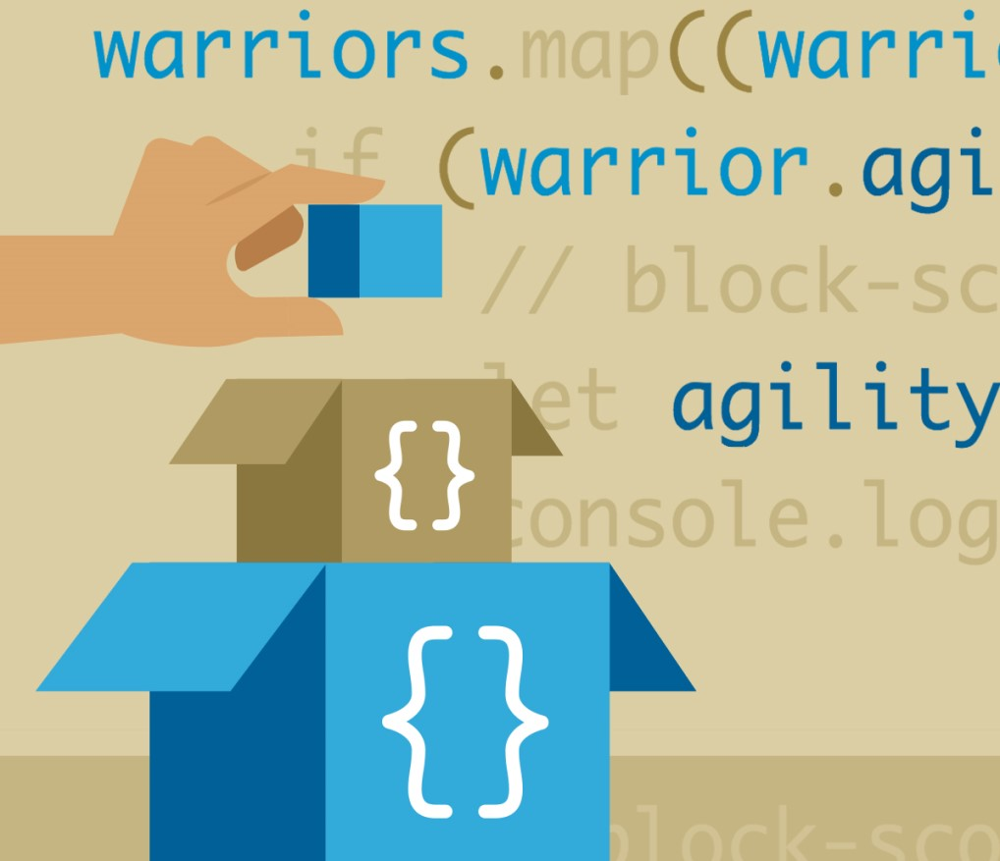
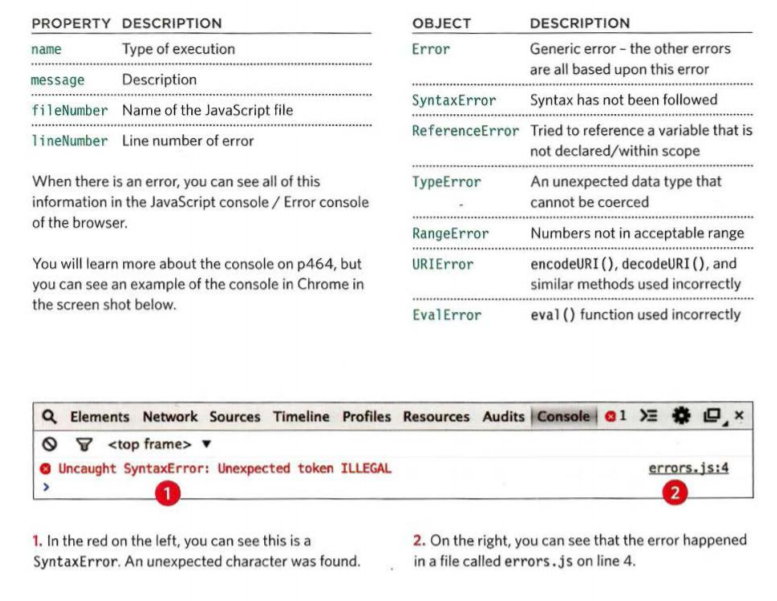

# JS Debugging

## Order Of Execution

To find the source of an error, it helps to know how scripts are processed.
The order in which statements are executed can be complex. functions dosent run istantly

and if it returns value to a previous function so it would be more complex

## Excution Contexts

The JavaScript interpreter uses the concept of execution contexts. 

there is three execution contexts that the statment have to be in one of them

1. GLOBAL CONTEXT
Code that is in the script, but not in a function.
2. FUNCTION CONTEXT
Code that is being run within a function.
3. EVAL CONTEXT (NOT SHOWN)
Text is executed like code in an internal function

### VARIABLE SCOPE

1. GLOBAL SCOPE
if you declared the var outside a function or statment (on the same page)
it is then on the global scope and can be used anywhere

2. FUNCTION-LEVEL SCOPE
can only be used inside the function that is declared in

The Stack

When several function used to get a value where a function runs in function and so one it is called a stack
in each function the vlue changes in order to get to the final needed value

## Excution Context and Hoisting

Two phases of excuting

1. Prepare:

- The new scope is created
- Variables, functions, and arguments are created
- The value of the this keyword is determined

2. Excute:

- Now it can assign values to variables
- Reference functions and run their code
- Execute statements

## Understanding The Scope

the context have it's own variables and function that can acsses them
it can also get to all it's parent, grand parent.... variables

## Understanding Errors

If javaScript Faced error it will stop and inform you about it
It  will stop working and does not continue to that next function ...

## Error Objects

## Error Objects Continued

Syntax Error: incorrect use of the rules like missing somethin or using " insread of ' and so on.

Reference Error: when you use variable without declare it or on differant scope.

Eval Error: When you use the Eval() Function wrong 

URI Error: When you use the URI() Function wrong 

Type Error: like using string instead of numbers

Range Error: If you call a function using numbers outside of its accepted range.

Error: The generic Error object is the template

NaN: means Not An Error, using string in math problems in your function

## How To Deal With It

1. DEBUG THE SCRIPT TO FIX ERRORS
track down the source of the error,and fix it.

2: Handel Them Gracefully
> using try, catch,throw, and f i na 1 ly statements. 

## Degugging WorkFlow

1. First Ask, Where is the problem?
    1. Check what the error message tells you
    2. check it's roots and where the stops
    3. Use breakpoints where things are going wrong.

2. Seconed Ask, What is the problem EXACTLY?
    1. In the breackpoints are the values as expected
    2. break out parts of the code to test smaller pieces of the functionality
    3.  Check the number of parameters

## Browser Dev Tools And JS Console

The JavaScript console will tell you when there is a problem with a script,
where to look for the problem, and what kind of issue it seems to be.

### CHROME/ OPERA
On a PC, press the F12 key or:

1. Go to the options menu (or three line menu icon)
2. Select Toots or More tools.
3. Select JavaScript Console or Developer Tools On a Mac press Alt + Cmd + J. Or:
4. Go to the View menu.
5. Select Developer.
6. Open the JavaScript Console or Developer Tools option and select Console.

### INTERNET EXPLORER
Press the F12 key or:

1. Go to the settings menu in the top-right.
2. Select developer tools.

### FIREFOX
On a PC, press Ctrl + Shift + Kor:

1. Go to the Firefox menu.
2. Select Web Developer.
3. Open the Web Console.

On a Mac press Alt + Cmd + K. Or:

1. Go to the Tools menu.
2. Select Web Developer.
3. Open the Web Console.

### SAFARI
Press Alt + Cmd + C or:

1. Go to the Develop menu.
2. Select Show Error Console.

If the Develop menu is not shown:

1. Go to the Safari menu.
2. Select Preferences.
3. Select Advanced.
4. Check the box that says "Show Develop menu in
menu bar."

Logging data to the console always help you track the values in your code

You can use:

`console.log()` to write on cosole
`console.info()` to store general info
`console.warn()` for warnnings
`console.error()` to hold errors
`console.group()` to group messages to console
`console.table()` method lets you output a table showing:

- objects
- arrays that contain other objects or arrays

`console.assert()`
to test if a condition is met, and write to the console only if the expression evaluates to false.

## Breakpoints

You can pause the execution of a script on any line using breakpoints.

### CHROME

1. Select the Sources option.
2. Select the script you are working with from the left-hand pane. The code will appear to the right.
3. Find the line number you want to stop on and click on it.
4. When you run the script, it will stop on this line.
You can now hover over any variable to see its value at that time in the script's execution.

### FIREFOX

1. Select the Debugger option.
2. Select the script you are working with from the left-hand pane.
The code will appear to the right.
3. Find the line number you want to stop on and click on it.
4. When you run the script, it will stop on this line.
You can now hover over any variable to see its value at that time in the script's execution.

## HANDLING EXCEPTIONS

If you know your code might fail, use try, catch, and finally.
Each one is given its own code block.

- TRY:
First, you specify the code that you think might throw an exception within the try block.

- CATCH:
If the try code block throws an exception, catch steps in with an alternative set of code.

- FINALLY:
The contents of the fina11y code block will run either way - whether the try block succeeded or failed.

## DEBUGGING TIPS 

- ANOTHER BROWSER
- ADD NUMBERS
- STRIP IT BACK 
- EXPLAINING THE CODE 
- SEARCH
- CODE PLAYGROUNDS 
- VALIDATION TOOLS 
