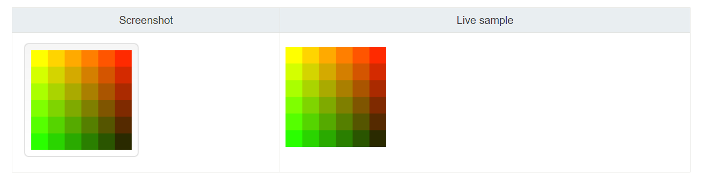
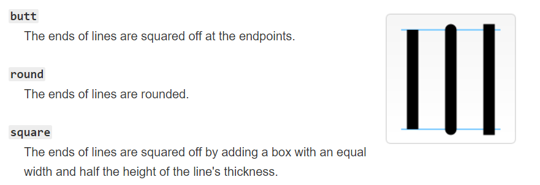
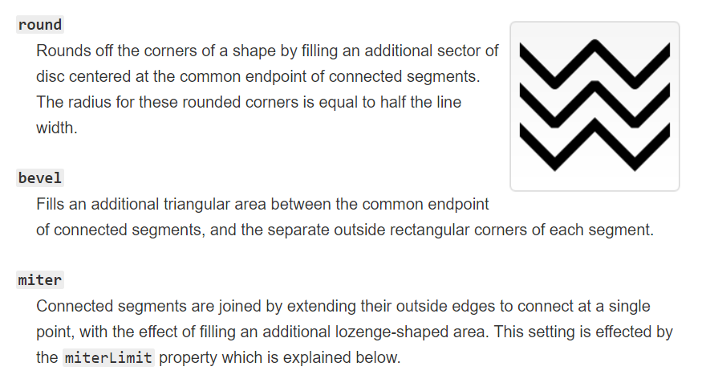
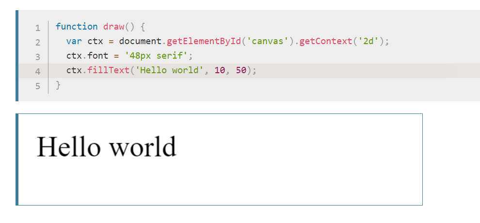

# Docs for the HTML <canvas> Element & Chart.js

Chart.js allow the user to create Animated cool charts 

Chart.js is a JavaScript plugin that uses HTML5’s canvas element to draw the graph onto the page
Charts are far better for displaying data visually than tables

To sit it up you have to download it and to your working directory and import the scripts

> To draw a line chart, the first thing we need to do is create a canvas element in our HTML in which Chart.js can draw our chart. So add this to the body of our HTML page:

`<canvas id="buyers" width="600" height="400"></canvas>`

> Next, we need to write a script that will retrieve the context of the canvas, so add this to the foot of your body element:

``

Inside the same script tags we need to create our data

`var buyerData = {`
 `labels : ["January","February","March","April","May","June"],`
 `datasets : [`
  `{`
   `fillColor : "rgba(172,194,132,0.4)",`
   `strokeColor : "#ACC26D",`
   `pointColor : "#fff",`
   `pointStrokeColor : "#9DB86D",`
   `data : [203,156,99,251,305,247]`
  `}`
 `]`
`}`

## Drawing a pie chart

After the canvas element you will add:

`var countries= document.getElementById("countries").getContext("2d");`
`new Chart(countries).Pie(pieData, pieOptions);`

pie chart is simpler, we just need to supply a value and a color for each section:

`var pieData = [`
 `{`
 ` value: 20,`
 ` color:"#878BB6"`
` },`
 `{`
  `value : 40,`
  `color : "#4ACAB4"`
 `},`
 `{`
  `value : 10,`
  `color : "#FF8153"`
 `},`
 `{`
  `value : 30,`
  `color : "#FFEA88"`
 `}`
`];`

Now you will add the options:

`var pieOptions = {`
 `segmentShowStroke : false,`
 `animateScale : true`
`}`

## Drawing a bar chart:

After the canvas element we create the graph:

`var income = document.getElementById("income").getContext("2d");`
`new Chart(income).Bar(barData);`

Then add the data

`var barData = {`
 `labels : ["January","February","March","April","May","June"],`
 `datasets : [`
  `{`
   `fillColor : "#48A497",`
   `strokeColor : "#48A4D1",`
   `data : [456,479,324,569,702,600]`
  `},`
  `{`
   `fillColor : "rgba(73,188,170,0.4)",`
   `strokeColor : "rgba(72,174,209,0.4)",`
   `data : [364,504,605,400,345,320]`
    `}`
 `]`
`}`

## The <canvas> element

At first sight canvas element seems like img but it doesn't have src or alt, but still have width and height
And if they are not specified the width will be 300px and height will be 150px by default and can be styled
like any other image

#### The rendering context

The `<canvas>` element creates a fixed-size drawing surface that exposes one or more rendering contexts, which are used to create and manipulate the content shown

#### Checking for support

you can check for support by testing for the presence of the getContext() method

var canvas = document.getElementById('tutorial');

`if (canvas.getContext) {`
  `var ctx = canvas.getContext('2d');`
  `// drawing code here`
`} else {`
  `// canvas-unsupported code here`
`}`

#### Drawing

`<canvas>` only supports two primitive shapes: rectangles and paths (lists of points connected by lines). All other shapes must be created by combining one or more paths

First let's look at the rectangle. There are three functions that draw rectangles on the canvas:

fillRect(x, y, width, height)
Draws a filled rectangle.

strokeRect(x, y, width, height)
Draws a rectangular outline.

clearRect(x, y, width, height)
Clears the specified rectangular area, making it fully transparent.

#### Colors

If we want to apply colors to a shape, there are two important properties we can use: fillStyle and strokeStyle.

fillStyle = color
Sets the style used when filling shapes.

strokeStyle = color
Sets the style for shapes' outlines.

In this example, we once again use two for loops to draw a grid of rectangles, each in a different color.

`function draw() {`
  `var ctx = document.getElementById('canvas').getContext('2d');`
  `for (var i = 0; i < 6; i++) {`
    `for (var j = 0; j < 6; j++) {`
      `ctx.fillStyle = 'rgb(' + Math.floor(255 - 42.5 *i) + ', ' +`
        `Math.floor(255 - 42.5* j) + ', 0)';`
      `ctx.fillRect(j * 25, i * 25, 25, 25);`
    `}`
  `}`
`}`

## Line styles

There are several properties which allow us to style lines.

lineWidth = value
Sets the width of lines drawn in the future.

lineCap = type
Sets the appearance of the ends of lines.

lineJoin = type
Sets the appearance of the "corners" where lines meet.

miterLimit = value
Establishes a limit on the miter when two lines join at a sharp angle, to let you control how thick the junction becomes.

getLineDash()
Returns the current line dash pattern array containing an even number of non-negative numbers.

setLineDash(segments)
Sets the current line dash pattern.

lineDashOffset = value
Specifies where to start a dash array on a line.

#### lineCap

#### lineJoin example

### Gradients

Just like any normal drawing program, we can fill and stroke shapes using linear and radial gradients.
We create a CanvasGradient object by using one of the following methods. We can then assign this object to the fillStyle or strokeStyle properties.

createLinearGradient(x1, y1, x2, y2)

Creates a linear gradient object with a starting point of (x1, y1) and an end point of (x2, y2).

createRadialGradient(x1, y1, r1, x2, y2, r2)

Creates a radial gradient. The parameters represent two circles, one with its center at (x1, y1) and a radius of r1, and the other with its center at (x2, y2) with a radius of r2.

### Shadows

Using shadows involves just four properties:

shadowOffsetX = float
Indicates the horizontal distance the shadow should extend from the object. This value isn't affected by the transformation matrix. The default is 0.

shadowOffsetY = float
Indicates the vertical distance the shadow should extend from the object. This value isn't affected by the transformation matrix. The default is 0.

shadowBlur = float
Indicates the size of the blurring effect; this value doesn't correspond to a number of pixels and is not affected by the current transformation matrix. The default value is 0.

shadowColor = color
A standard CSS color value indicating the color of the shadow effect; by default, it is fully-transparent black.

## Drawing text
The canvas rendering context provides two methods to render text:

fillText(text, x, y [, maxWidth])
Fills a given text at the given (x,y) position. Optionally with a maximum width to draw.

strokeText(text, x, y [, maxWidth])
Strokes a given text at the given (x,y) position. Optionally with a maximum width to draw.

- fillText example

#### Styling text

In the examples above we are already making use of the font property to make the text a bit larger than the default size. There are some more properties which let you adjust the way the text gets displayed on the canvas:

font = value
The current text style being used when drawing text. This string uses the same syntax as the CSS font property. The default font is 10px sans-serif.

textAlign = value
Text alignment setting. Possible values: start, end, left, right or center. The default value is start.

textBaseline = value
Baseline alignment setting. Possible values: top, hanging, middle, alphabetic, ideographic, bottom. The default value is alphabetic.

direction = value
Directionality. Possible values: ltr, rtl, inherit. The default value is inherit.
