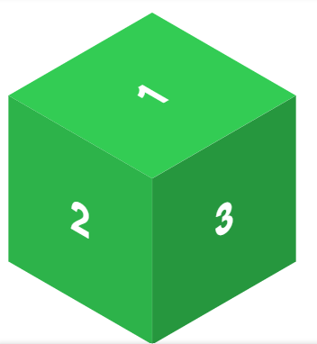
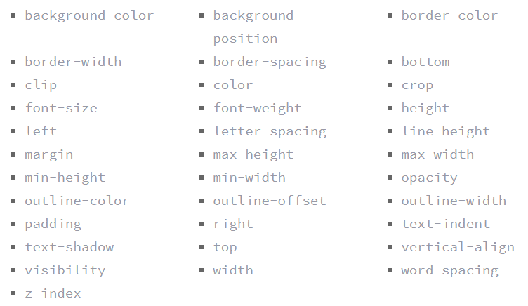

# CSS Transforms, Transitions, and Animations

## Transforms
Now general layout techniques can be revisited with alternative ways to size, position, and change elements.
`transform` property comes in two different settings, two-dimensional and three-dimensional.

### Transform Syntax

`div {`
  `-webkit-transform: scale(1.5);`
    `-moz-transform: scale(1.5);`
       `-o-transform: scale(1.5);`
          `transform: scale(1.5);`
`}`

The value specifies the transform type followed by a specific amount inside parentheses

### 2D Transforms
Two-dimensional transforms work on the x and y axes

### 2D Rotate
  `transform: rotate(20deg);`

rotate and the rotation degree

### 2D Scale
Using the scale value within the transform property allows you to change the appeared size of an element. The default scale value is 1

## 2D Translate

The translate value works a bit like that of relative positioning, pushing and pulling an element in different directions without interrupting the normal flow of the document.

`transform: translate(-10px, 25%);`

### 2D Skew
used to distort elements on the horizontal axis, vertical axis, or both. 

`transform: skew(5deg, -20deg);`

### 2D Cube Demo

`.cube {`
  `position: relative;`
`}`
`.side {`
  `height: 95px;`
  `position: absolute;`
  `width: 95px;`
`}`
`.top {`
  `background: #9acc53;`
  `transform: rotate(-45deg) skew(15deg, 15deg);`
`}`
`.left {`
  `background: #8ec63f;`
  `transform: rotate(15deg) skew(15deg, 15deg) translate(-50%, 100%);`
`}`
`.right {`
  `background: #80b239;`
  `transform: rotate(-15deg) skew(-15deg, -15deg) translate(50%, 100%);`
`}`

### Transform Origin

the default transform origin is the dead center of an element, both 50% horizontally and 50% vertically.
can accept one or two values.

### Perspective
In order for three-dimensional transforms to work the elements need a perspective from which to transform.

 `transform: perspective(200px) rotateX(45deg);`

the mmore you add to the value the more the depth is and the element will seem farther

### Perspective Origin
same values used for the transform-origin property may also be used with the perspective-origin property, and maintain the same relationship to the element.

## 3D Transforms
there is another axis along which we can transform elements.
Using three-dimensional transforms we can change elements on the z axis, giving us control of depth as well as length and width.

### 3D Rotate

including rotateX, rotateY, and rotateZ.

`.box-1 {`
  `transform: perspective(200px) rotateX(45deg);`
`}`
`.box-2 {`
  `transform: perspective(200px) rotateY(45deg);`
`}`
`.box-3 {`
  `transform: perspective(200px) rotateZ(45deg);`
`}`

### 3D Translate

Elements may also be translated on the z axis
A negative value here will push an element further away on the z axis, resulting in a smaller element.

### 3D Skew
Skew is the one two-dimensional transform that cannot be transformed on a three-dimensional scale

### Transform Style
The transform-style property needs to be placed on the parent element, above any nested transforms. The preserve-3d value allows the transformed children elements to appear in their own three-dimensional plane while the flat value forces the transformed children elements to lie flat on the two-dimensional plane.

### Transitions & Animations

### Transitions
an element must have a change in state, and different styles must be identified for each state. The easiest way for determining styles for different states is by using the `:hover`, `:focus`, `:active`, and `:target` pseudo-classes.

`.box {`
  `background: #2db34a;`
  `transition-property: background;`
  `transition-duration: 1s;`
  `transition-timing-function: linear;`
`}`
`.box:hover {`
  `background: #ff7b29;`
`}`

### Transitional Property

The transition-property property determines exactly what properties will be altered in conjunction with the other transitional properties. By default, all of the properties within an element’s different states will be altered upon change. However, only the properties identified within the transition-property value will be affected by any transitions.

`.box {`
    `background: #2db34a;`
    `border-radius: 6px`
    `transition-property: background, border-radius;`
    `transition-duration: 1s;`
    `transition-timing-function: linear;`
  `}`
  `.box:hover {`
    `background: #ff7b29;`
    `border-radius: 50%;`
  `}`

### Transitional Properties

### Transition Duration

The duration in which a transition takes place is set using the `transition-duration` property.
The value of this property can be set using general timing values, including seconds (s) and milliseconds (ms).
These timing values may also come in fractional measurements, .2s for example.

### Transition Timing
The `transition-timing-function` property is used to set the speed in which a transition will move.

### Transition Delay
you can also set a delay with the transition-delay property.
The delay sets a time value, seconds or milliseconds, that determines how long a transition should be stalled before executing.

## Animations

## Animations Keyframes
set multiple points at which an element should undergo a transition, use the `@keyframes` rule.
The `@keyframes` rule includes the animation name, any animation breakpoints, and the properties intended to be animated.

`@keyframes slide {`
  `0% {`
    `left: 0;`
    `top: 0;`
  `}`
  `50% {`
    `left: 244px;`
    `top: 100px;`
  `}`
  `100% {`
    `left: 488px;`
   `top: 0;`
  `}`
`}`

### Animation Name
Once the keyframes for an animation have been declared they need to be assigned to an element.
To do so, the animation-name property is used with the animation name

`.stage:hover .ball {`
  `animation-name: slide;`
`}`

### Animation Duration, Timing Function, & Delay

Once you have declared the animation-name property on an element, animations behave similarly to transitions.

### Animation Play State

`.stage:hover .ball {`
  `animation-name: slide;`
  `animation-duration: 2s;`
  `animation-timing-function: ease-in-out;`
  `animation-delay: .5s;`
  `animation-iteration-count: infinite;`
  `animation-direction: alternate;`
`}`
`.stage:active .ball {`
  `animation-play-state: paused;`
`}`
