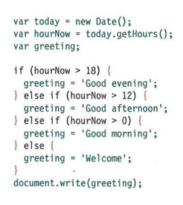
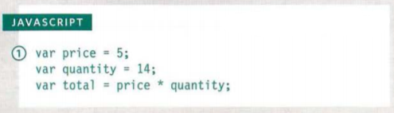
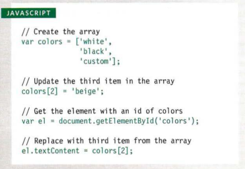
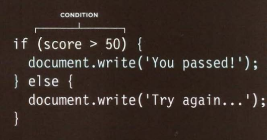
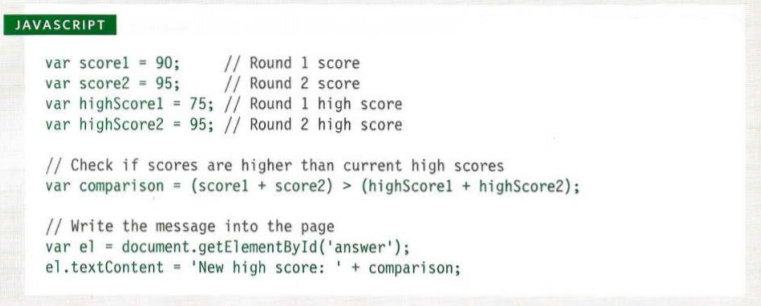
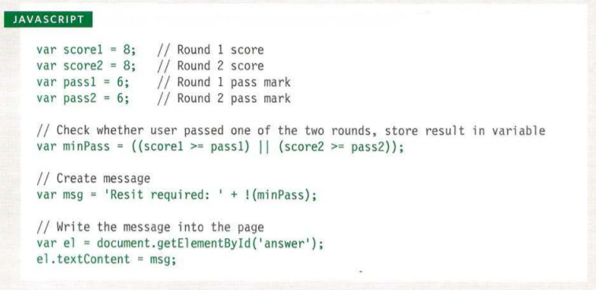

# Basics of HTML, CSS & JS

In this section i will mention some of the most imprtant basics in

## HTML

Some impotant tags in HTML:

- Headings:

# `<h1>`

## `<h2>`

### `<h3>`

#### `<h4>`

##### `<h5>`

###### `<h6>`

- Paragraphs: `
`
- *italic* `<i>`
- **Bold** `<b>`
- Breaks ` `
- Line Breaks `
`

There are also tags that doesn't necessary change on the actual Text but they add the info and some of them change a bit on the text by default thier name is **Semantic Markup** Such As:

- `<strong>` Indicates that this part is important also makes the text bold the text in between
- `<em>` Indicates the word/s that can change the meaning of the sentance, also makes the text italic in between
- `<address>` Indicates the Auther contact details, doesn't change on the form of the text
- `<s>`, `<ins>` and `<del>` And alots more

## CSS

There is 3 ways to write the CSS for your HTML

1. Inline: By typing the CSS commands in the same tag such as `<h1 style="color:green;"></h1>`
To make the text color of this h1 green

2. Internal: In the contant you can write the whole css for the html file
`<head>`
    ``
`</head>`

3. External: By creating a CSS file then linking the html to it using this command in the head

`<head>`
    `<link rel = "stylesheet" type = "text/css" href = "NameOfTheCSSFile.css"/>`
`</head>`
Then writing commands normally in the file

In bothe the Internal and External CSS you have to selecte elements by calling them by their:

- General `* {The command}` will apply changes on everything
- type    `TagName {The command}` if you typed p in tag name all paragraphs will apply the settings 
- class   `.ClassName {The command}` every element have the class name
- id      `#ID {The command}` the single element that has that ID
- child   `ul>li {The command}` every list item that is inside unorder list will apply the settings
- etc

> If an element have 2 or more settings that have to be applied for it, it will apply the last rule written
and if their is specific rules for it, it will take the most specific on of them and apply it

## JavaScript

First:
Like the CSS you can write scripts in the same file or in an external one but it is always prefared to have it external and the link to it in the end of the body so the contant of the page load before it
``

Statments: Whish are a step by step instructions for the computer to follow by variables and rules Ex:

variable is unassigned value that can be any data type numric, string or boolean (true or false) and it is used to store them Ex:

When you are using the variabiles to assign multi-values it is named Array
The values in Arrays are numbered by default and you can call them by number
the numbering starts from 0,1,2,..etc
And you can update the value as following:

Evaluating conditions statements:

If score is bigger than 50 the script writes 'You Passed!' on the html

Comparition Operators:

- == to see if they are the same
- != to see if they are not the same
- === to see if they are the same in value and type
- !== to see if they are not the same in value and type
- (>) Greater than ,  >= Greater or Equal
- (<) Less than ,  <= Less or Equal
Ex:

Logical Operators:

- && (And): To test more than one condition
- || (Or): To test if at least one condition is true
- ! (Not): Invert single Boolen value output
Ex:

Comments: Are used to remind you what your code does it is really usefull when it come to complicated projects and woking in teams

`// This is the comment`
or if the comment took multiple lines you can use
`/* This is the comment */`
