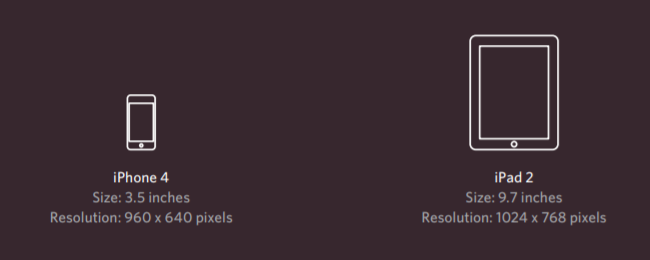

# HTML Links, CSS Layout, JS Functions

## HTML Links:

To add a link to your page you will use the `<a>` tag the way below using it's special attribute `href`

`<a href="the link you want to add">the txt you want people to click on</a>`

Note: You have to provide the full URL
You can also use it to like to other pages of your site and organize it
If you have your pages in folders forming tree's you have to call them in the same way

if the page you ar ewriting on on the same level (folder) of the target you can call it after the href by its full name ex:

`<a href="house1.html">Here i the first house</a>`

Child level you have to call it's father folder than call it EX:

`<a href="Albayader/house1.html">Here i the first house</a>`

If it was in the parent/higher level can't call ***By The Name Of Fathers*** Instead to type `..` EX:
if you were typing from house 2

`<a href="../house1.html">Here i the first house</a>`

And so on

The href can be also used to open email form by using 

`mailto:TheEmail.com` EX:

`<a href="mailto:halloservice@gmail.com">Contact Us By Email</a>`

If you want to open the new provided link by hred in a new tab istead of the same tab you are at use

`target="_blank"` After the address

Or you can use `href` to move you to a specific part of the page By:

Using the #ID instead of the link of the element you want to travle to

And if that specific part in on another page just right the URL followed by `/#ID` of the target element

**Easy enough right? Lets Move To The Next Concept Then.**

## CSS Layout:

The CSS is trating elements as if they are in their own boxes (block level box) or (inline box) by default.

**Block-level: Starts on a new line**
**Inline elements: Flow in between surrounding text**

If one block-level element sits inside another block-level element

then the outer box is known as the containing or parent element.

There is somrthing in CSS called positioning schemes that allow you to control the layout of a page:

- Normal flow Every block-level element appears on a new line

Normal Flow
by default the browsers make each element sits on the top of the next one but if you want the syntax for it it is 

`position:static`

**Relative Positioning:** This moves the element in the 4 directions
from its position in normal flow with out affecting other elements around it

**Absolute Positioning:** The box offset properties (top or bottom and left or right)
specify where the element should appear in relation to its containing element
gets the element out of normal flow
makes the element get out of the flow and get ignored by other elements

**Fixed Positioning:** This make the element has a fixed position
on the screen and will stay in the same postion in the viewer screen
even when he scroll down *-gets out of the flow-*

**Overlapping elements:** Moving elements on the z-index giving an element a hight z-index value

will make it appeare in front of other elements

**Floating Elements:** makes the element float to the far left or right,

gets oyt of the flow and make it block level element

Clearing floats: clear used to say that it is not allowed to touch elements 
floating in the 

- `clear:left;` left side
- `clear:right;`right side
- `clear:both;`both sides
- `clear:none;`it is allowed to do so for both sides

if all contend of and element are set to be floating the browser will consider it as 0 pixel element and collapse it
to solve that here is the 2 rules that developers made for this issue

`overflow: auto;`
`width: 100%;`

**Screen Sizes**

The user can see as much as his screen let him do
and because screens vary in sizes and resolutions it is optimal for designers to 
create pages around 960-1000 px so the most can see it as intended to be

**Fixed Width Layouts**

**Liquid Layouts**

In order to use **Liquid Layouts** use `em` and `%` instead of `px`

Using the 960.GS Grid

this layout dividing page into 12 columns from 960 pixle

it also provide other templates you can download to help you design your website
it handles the whole layout you just have to set the fonts ,colors ,backgrounds ,margins and paddings

**Using Multiple Style Sheets**
you can do it either by using 2 `link` in your HTML

Or

Liking to one style sheet and using `@import` to import from other style sheets
EX:

`@import url("colors.css");`

**JavaScript Functions:**
**Functions** are series of statements and rules that perform a specific task.

Example for basic functions:

When you want to create one

- First type`Function`
- Then the name of it
- Braces
- Curly braces holds the statments

And you you want it call it by name
From the example:

`sayHello();`

You can use the function to do some calculation by providing info for it,

And adding the command `return TheNeededValueName;`

So you can get use of it

**Function declaration:** creates a function that you can call later in your code

**Function expression:** If you put a function where the interpreter would expect to see an expression, then it is treated as an expression

**Variables Types:**

- Local Variables: When a variable is created inside a function
- Global Variables: When a variable is created outside a function

***Variables in global scope: have naming conflicts.***
***Variables in function scope: there is no conflict between them.***
