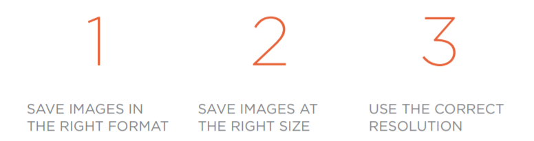
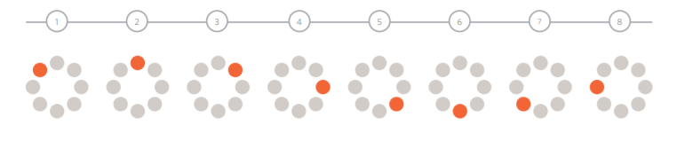
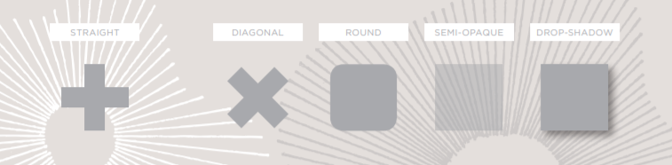
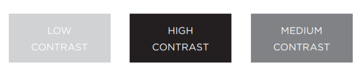
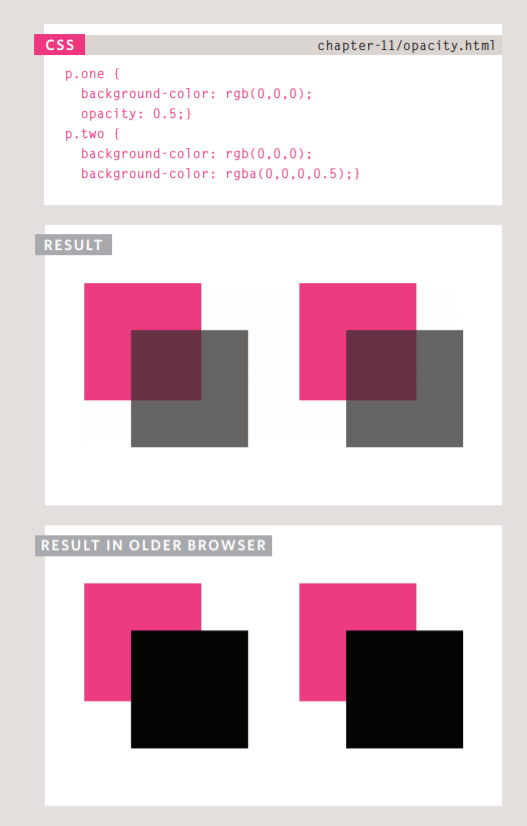
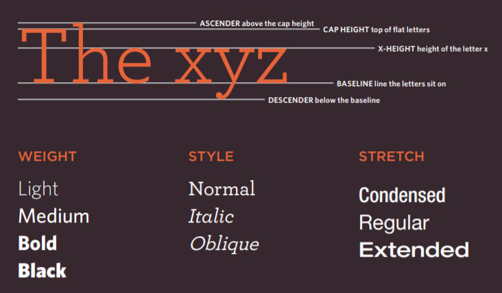
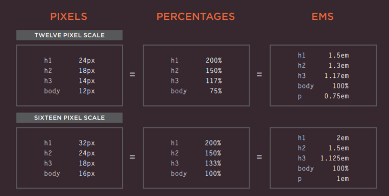
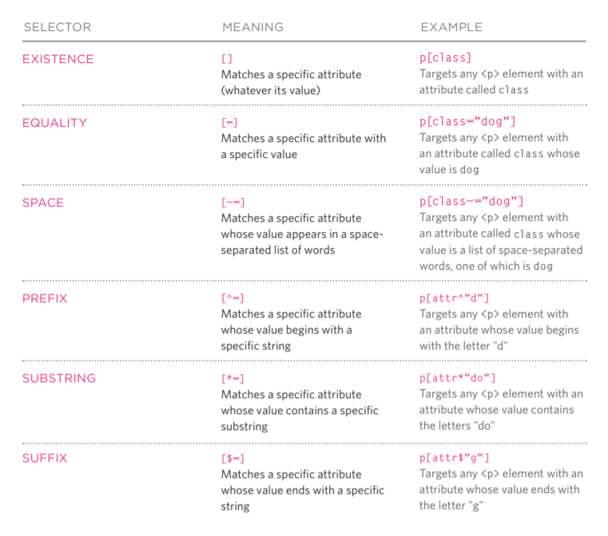

# HTML Images; CSS Color & Text

First Before Start Adding Imges All Over The Place Consider
To fit in your sit in colors and consept

To keep your site organized it is preferred to put your imges in a folder 

Or organized them into separate folders if your site is really big

The `` tag:
You already know that we use the `` to insert images into the website using the attribute

`<src="imageDirictory.jpg">` 

Their is also use the attributes: 

`<alt>` to provide description about the img if the browser faild to load it

`<title>` you can use it to add description about the img browser show this massage when you hovor the mouse on the img

**Where yo ucan add it?**

you can add it before the paragraph on in it start or middle

to suits your website you can custmize its:
width
height
float

There were an old code fpr imgs name align to align the first line surrounds to be at the top, middle or bottom of the image

**The 3 images creating rules**

Image resolution and size: you can edit it by using any image editor

So if your image is differ from what you specified for it,
You can reduce, increase or even resize it's shape in the image editors While maintaining it
Without harming.

When doing so most of images getting harmed cause of the resolution changes so what did programers do?

They started using Vector images instead.

**Vector Images?**

They are created by placing points on a grid, and drawing lines between those points
So you can increase the dimensions of the image without affecting the quality of it.

> Images best saved as JPEGs; illustrations or logos

**Animated GIFs:** show several frames of an image in sequence and therefore can be used to create simple animations

Creating an image that is partially transparent (or "see-through") for the web involves selecting one of two formats:
Transparent GIF - PNG

`<figure>` element to contain images and their caption so that the two are associated.

`<figcaption>` element allow web page authors to add a caption to an image.

**The color property**

Using the RGB, Hex or Color name it allows you to change color of elements

Rgb Value: Red, Green, Blue value out of 255 like `rgb(102,205,170)`

Hex Value: uses hexadecimal code instead of numbers

Name: simply call it

**Contrast:**

**Opacity**
Opacity property allows you to set the opacity for an element but sadly it doesnt work in older browsers

HSL and HSLA Coloring

the are the same as RBG but instead of value it is percentage but,

In HSLA there is additional opacity out of 1 so if you want 50% opacity you may type it 0.5 and so on

Text Fonts/Typeface Terminology

**Serif** fonts have extra details on the ends.

**Sans-Serif** Sans-serif fonts have straight ends to letters.

**Monospace** Every letter in a monospace (or fixed-width) font is the same width.

Techniques That Offer a Wider Choice of Typefaces
font-family
font-face
Service-based Font-Face

The font-family property
allows you to specify the typeface that should be used

`font-family: Georgia, Times, serif;`

it uses more than one value of font so,

if the font isnt supported or installed for the user it well choose the next one 

- **`font-wight`**
 - normal
 - bold

- **`font-style`**
 - normal
 - italic
 - oblique

- **`text-transform`**
 - uppercase
 - lowercase
 - capitalize: This causes the first letter of each word to appear capitalized

- **`text-decoration`**
 - none: remove all decoration
 - underline
 - overline
 - line-through
 - blink: makes the text flashs and it is really ***annoying***

- **`letter-spacing`, `word-spacing`:**
 litterly making spaces between each on of them

- **`text-align`**
 - left
 - right
 - center
 - justify:  indicates that every line in a paragraph, except the last line, should be set to take up the full width of the containing box.

- **`vertical-align`**
 - baseline
 - sub
 - super
 - top
 - text-top
 - middle
 - bottom
 - text-bottom

- **`text-indent`**
 allows you to indent the first line of text 

- **`text-shadow`**
Gives a shadow for the text and asign 4 values for it 
Horizontal Scale, Vertical Scale, Blur then the color of the shadow, Ex:

`text-shadow: 1px 1px 3px #666666;}`

- **Pseudo-elements**
`:first-letter, :first-line` these are not properties

- **Styling Links**
 - link set styles for links that are not visited yet
 - visited set styles for links that are visited

- **Responding to Users**
 - hover: This is applied when a user hovers over an element
 - active
 - focus

- **`font-size`**
you can use px, em and percentage values to change the font size

**Units of Type Size**

@font-face allows you to use a font, even if it is not installed on the computer of the person browsing, by allowing you to specify a path to a copy of the font after you download it 

as in the Example:

`@font-face {`
    `font-family: 'ChunkFiveRegular';`
    `src: url('fonts/chunkfive.eot');}`
`h1, h2 {`
    `font-family: ChunkFiveRegular, Georgia, serif;}`

**Attribute Selectors:**

